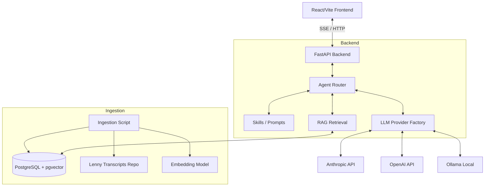

# Architecture & Design Decisions

This document outlines the technical decisions and design of the Lenny Growth Assistant.

## 1. System Architecture

The application is built on a standard modern three-tier architecture, augmented with an AI Agent layer and a Vector Database.

## 2. Agent Layer & Skills (Strategy Pattern)

Instead of a monolithic prompt, the agent layer uses the **Strategy Pattern** to dynamically route user input to specialized "skills".

1. **Routing:** If the client doesn't force a skill, a lightweight LLM call or keyword heuristic determines if the user wants Q&A or a Ship 30 Essay.
2. **Skills:**
   - `grounded_qa`: Strict QA format. Focuses purely on accuracy. Refuses to answer off-topic questions.
   - `ship30_essay`: Long-form generation. Adheres to a strict markdown structure (Title, Subtitle, Intro, 3-point body, Conclusion). Triggers artifact generation.
3. **Provider Abstraction:** The `LLMProvider` protocol abstracts Anthropic, OpenAI, and Ollama. The app can switch dynamically via `.env` without changing a single line of business logic.

## 3. RAG Pipeline

To ensure the LLM generates accurate content, we implemented a sophisticated retrieval pipeline.

1. **Hybrid Search:** 
   - **Vector Search (Cosine Similarity):** Finds semantic meaning using `pgvector` (`text-embedding-3-small` or `nomic-embed-text`).
   - **Full-Text Search (tsvector):** Finds exact keyword matches.
2. **Reciprocal Rank Fusion (RRF):** Merges the results of Vector and Full-Text search to get the best of both worlds.
3. **Maximal Marginal Relevance (MMR):** To prevent the context window from being flooded with 5 chunks from the exact same paragraph, MMR penalizes redundant chunks and optimizes for diversity.
4. **Chunking Strategy:** Paragraph-aware chunking (approx. 400 tokens) with a 20% overlap prevents cutting context mid-sentence.

## 4. Artifact Sanitization (Security)

Generating and rendering HTML/Markdown from an LLM carries XSS risks. We employ a **Defense-in-Depth** strategy:

1. **Server-Side Sanitization:** The backend uses Python `bleach` to strip dangerous tags (`script`, `iframe`, `object`) and attributes (`onclick`, `javascript:` URIs) before saving to the database.
2. **Client-Side Sanitization:** The React frontend parses Markdown using `marked` and sanitizes the output using `DOMPurify` configured with a strict allowlist.
3. **Sandboxed Iframes:** If the artifact is raw HTML, the frontend renders it inside an `<iframe sandbox="">`. This guarantees that even if malicious JS bypasses sanitization, the browser blocks execution, popup creation, and form submissions.

## 5. Resilience & Fallbacks

- **Graceful Degradation:** If the selected Cloud LLM provider is down or a key is missing, the backend Factory automatically attempts to fall back to the local Ollama provider.
- **Race Conditions:** `docker-compose.yml` ensures Ollama pulls models in a separate `ollama-init` container so the backend doesn't crash during initialization.
- **Timeouts:** All HTTP clients (Anthropic, httpx) use strict timeouts to prevent hanging SSE streams.
